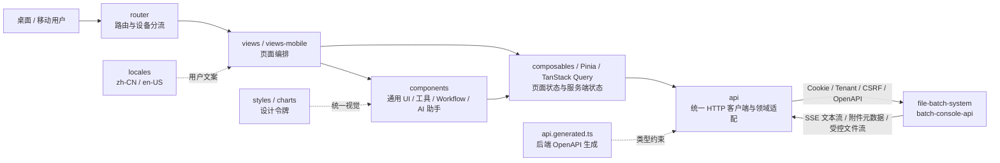

# batch-console 项目结构

> 2026-10-01 更新。Vue 3 + TypeScript + Pinia + Element Plus 控制面前端,桌面 + 移动端双端。

## 顶层结构

```
batch-console/
├── src/                       前端源码(见下)
├── public/                    静态资源(favicon / robots / manifest)
├── e2e/                       Playwright e2e 测试
├── e2e-data/                  e2e fixture / seed 数据
├── docs/                      工程文档体系(见下)
├── design/                    前端设计稿输入,只读保留,不并入 docs/
├── nginx/                     prod Nginx 配置
├── scripts/                   工程脚本(见下)
├── tools/docs-bridge/         前后端 docs 跨仓桥接工具
├── .github/                   GitHub Actions / PR 模板等
├── .husky/                    Git hooks
├── .vscode/                   共享编辑器配置
│
├── dist/                      build 产物(.gitignore)
├── coverage/                  Vitest coverage 产物(.gitignore)
├── playwright-report/         Playwright HTML 报告(.gitignore)
├── test-results/              Playwright 运行结果(.gitignore)
├── test-excel-abc/            e2e Excel 临时 fixture(.gitignore)
├── logs/                      本地验证日志(.gitignore)
├── .remember/                 本地 session memory(.gitignore)
├── .codex-audit/              本地审计缓存(.gitignore)
├── .agents/                   仓库级 Agent 技能
├── .idea/                     本地 IDE 状态,workspace.xml 忽略
│
├── index.html                 SPA 入口
├── package.json               依赖 + npm scripts
├── package-lock.json          npm 锁文件
├── vite.config.ts             Vite 配置
├── tsconfig.json              TypeScript 根配置
├── tsconfig.app.json          应用 TS 配置
├── tsconfig.node.json         Node/Vite TS 配置
├── eslint.config.js           ESLint 9 配置
├── playwright.config.cjs      Playwright 配置
├── Dockerfile                 容器镜像
├── docker-compose.yml         本地与自托管部署编排
├── Makefile                   常用任务 alias
├── AGENTS.md                  项目红线 + 关键路径(权威)
└── CHANGELOG.md               发布日志(release-please 维护)
```

## 顶层目录归类

| 类别     | 目录                                                                                                            | 处理原则                                         |
| -------- | --------------------------------------------------------------------------------------------------------------- | ------------------------------------------------ |
| 产品源码 | `src/`, `public/`, `nginx/`                                                                                     | 随功能重构正常演进                               |
| 测试资产 | `e2e/`, `e2e-data/`                                                                                             | 保持与核心桌面路径同步;移动端默认不新增 e2e      |
| 工程文档 | `docs/`                                                                                                         | 按 `docs/README.md` 的目录分层维护               |
| 设计输入 | `design/`                                                                                                       | 作为前端设计稿输入独立保留,默认只读,不做目录整理 |
| 工程脚本 | `scripts/`, `tools/`                                                                                            | 可重构,但要保留 CLI 入口兼容性                   |
| 仓库配置 | `.github/`, `.husky/`, `.vscode/`                                                                               | 随 CI / DX 需求维护                              |
| 本地产物 | `dist/`, `coverage/`, `playwright-report/`, `test-results/`, `logs/`, `.remember/`, `.codex-audit/` | 已由 `.gitignore` 管理,不提交                    |

## src/ 子目录

```
src/
├── api/                    REST 客户端 + 按领域拆分的查询适配
│   └── queries/            TanStack Query 查询定义
├── stores/                 Pinia stores(auth / theme / mobileBadges / ...)
├── router/                 Vue Router 路由与桌面/移动分流
├── views/                  桌面页面(job / workflow / observability / config / system / ...)
├── views-mobile/           移动端页面(/m/*)
├── layout/                 桌面 layout(DefaultLayout / LayoutHeader / LayoutSidebar / ...)
├── layout-mobile/          移动端 layout(MobileLayout / MobileTabBar / MobileAppBar / ...)
├── components/             跨页通用组件
│   ├── common/             DataState / TraceIdInput / AI 助手展示与附件选择等
│   ├── table/              数据表格通用能力
│   ├── tools/              顶栏批处理工具
│   └── workflow/           Workflow 展示与交互组件
├── composables/            Vue 组合式函数
│   └── queries/            查询状态与页面数据流复用
├── locales/                i18n 词条(zh-CN / en-US 1:1 必须对齐)
├── styles/                 全局样式 + design tokens
├── charts/                 ECharts 配色与封装
├── constants/              枚举常量(severity / status / role / ...)
├── directives/             自定义指令(v-permission / v-track / ...)
├── types/                  共享类型 + OpenAPI 生成类型
└── utils/                  无副作用工具(format / clipboard / safe HTML / ...)
```

目录数量不作为长期架构事实记录；文件规模由 CI 和带日期的审计报告统计，避免新增页面后结构文档失真。

## 前端调用结构图



AI 图片和文件附件仍通过 `src/api/ai.ts` 访问 `batch-console-api`，浏览器不直连对象存储，也不持有对象存储凭据；历史消息只消费后端返回的附件元数据和受控读取地址。

## 模块划分(views/)

| L1 模块         | 路由前缀           | 一句话职责                                |
| --------------- | ------------------ | ----------------------------------------- |
| `job`           | `/job/*`           | Job 定义 / Job 实例 / 历史                |
| `workflow`      | `/workflow/*`      | Workflow DAG 编排 / Run / 节点干预        |
| `observability` | `/obs/*`           | Alert / Outbox / Trace / Metrics          |
| `ops`           | `/ops/*`           | BatchDayReplay / 数据对账 / Forensic 导出 |
| `approvals`     | `/approvals/*`     | 审批列表 / 批量审批 / 历史                |
| `config`        | `/config/*`        | 配置发布 / Schema / 字典                  |
| `system`        | `/system/*`        | 租户 / 用户 / RBAC / API Key / 通知通道   |
| `auth`          | `/login` / `/init` | 登录 / 初始化                             |
| `m/*`           | `/m/*`             | 移动端入口(双栈不共用 view)               |

## 关键 composable / 基建

| 名字               | 用途                                                                 |
| ------------------ | -------------------------------------------------------------------- |
| `useRouteFilters`  | List 页 filters + page + pageSize 写入 URL query                     |
| `useResponsive`    | `matchMedia` 响应式断点(mobile / tablet / desktop)                   |
| `useDirtyForm`     | Form 改动追踪 + `beforeunload` + Dialog before-close 弹 confirm      |
| `useFormFocus`     | Dialog/Drawer open autofocus 第一字段;validate fail focus 第一 error |
| `useFormValidate`  | 统一 form 校验(收集错误 → useFormFocus 接力)                         |
| `useDangerConfirm` | 高危 ops 二次确认(打字校验 / 长按)                                   |
| `useWebPush`       | Web Push 注册 / 解绑(VAPID)                                          |
| `useOpsSummary`    | 运营总览数据聚合                                                     |
| `useAsyncAction`   | 异步动作 loading / error / retry 包装                                |

## docs/ 体系

```
docs/
├── README.md                  文档入口
├── changelog.md               重要架构 / 约定变更日志
│
├── api/                       OpenAPI 同步 / API 漂移检查
├── architecture/              架构与项目结构说明
├── archive/                   历史归档(已关闭项目 / 失效方案 / 旧验收证据)
├── audits/                    设计 / 可用性 / 代码审计证据
├── backlog/                   未完成且有验收条件的开发 / 环境验收事项
├── deploy/                    部署文档(docker-nginx)
├── engineering/               当前工程方案(meta-enum / mobile-refresh / 可观测性 / 文档站)
├── qa/                        QA 文档入口；已关闭 campaign 在 archive/
├── reports/                   日期化评审 / 验收 / 扫描报告
├── testing/                   测试体系说明
├── runbook/                   运维手册(ci / dev-workflow / rollback / 联测)
└── verifications/             验证记录(CD / e2e)
```

> `design/` 是当前视觉规格与参考稿唯一来源；旧原型和截图位于 `docs/archive/redesign-2026-07/`，仅作历史证据。

## scripts/ 体系

```
scripts/
├── check-api-drift.sh      检查 BE OpenAPI 与 FE 类型漂移
├── check-i18n-messages.mjs  zh-CN / en-US 1:1 对齐校验
├── ci.sh                   无后端本地完整门禁(只检查，不修改工作区)
├── dev-server.sh           本地 dev 启动
├── docs-prepare.mjs        docs 跨仓 sync 预处理
├── gen-pwa-icons.mjs       PWA 图标生成
├── prepare.mjs             postinstall 钩子(husky / 等)
├── test-e2e.sh             Playwright e2e 入口
├── test-unit.sh            Vitest 单测入口
└── local/                  本地特定
    ├── fe-acceptance.sh    真实环境 acceptance 入口，基础设施缺失即失败
    ├── health-check.sh     dev server 健康检查
    └── sync-from-main.sh / sync-main.sh    跨仓 main 同步
```

## 关键约束(详 [`../../AGENTS.md`](../../AGENTS.md))

- **i18n 强制双语**:zh-CN / en-US `messages.ts` 1:1;`check-i18n-messages.mjs` 守护
- **禁硬编码中文**:UI 文本走 `t('key')`(JobDefinitionList 历史违例已修)
- **桌面 / 移动双栈**:`/m/*` 路径独立 view,不与桌面 view 共用(避免响应式条件分支地狱)
- **Pinia store**:只放跨页状态(auth / theme / mobileBadges);页内状态用 ref / composable
- **API 错误处理**:`api/interceptors.ts` 统一 401 三态 / 404 BizException / 409 IDEMPOTENT_REPLAY 静默
- **OpenAPI 同步**:BE 改 controller 必须同 PR 改 `docs/api/console-api.openapi.yaml`,FE 端 `check-api-drift.sh` 兜底

## 构建命令

| npm script               | 用途                                        |
| ------------------------ | ------------------------------------------- |
| `npm run dev`            | Vite dev server(默认 http://localhost:5173) |
| `npm run build`          | 类型检查 + i18n 检查 + 生产打包 → `dist/`   |
| `npm run build:fast`     | 只跑 Vite build,本地快速验证用              |
| `npm run preview`        | 本地预览 build 产物                         |
| `npm run lint`           | ESLint 自动修复                             |
| `npm run lint:check`     | ESLint 只检查                               |
| `npm run typecheck`      | `vue-tsc --noEmit`                          |
| `npm run gen:api`        | 从后端 OpenAPI 生成 FE API 类型             |
| `npm run gen:api:check`  | 检查 FE 与 BE OpenAPI 漂移                  |
| `npm run check:i18n`     | zh-CN / en-US locale key 对齐检查           |
| `npm run test:unit`      | Vitest 单测                                 |
| `npm run test:e2e`       | Playwright e2e                              |
| `npm run test:e2e:all`   | Playwright 全量 e2e                         |
| `npm run test:e2e:smoke` | 冒烟子集                                    |
| `npm run docs:serve`     | 前后端统一文档站 build + preview            |
| `npm run dev:all`        | 控制台 + 一个文档服务；同源 `/docs/`          |

## 分支策略(与 BE 一致)

| 分支              | 用途                      |
| ----------------- | ------------------------- |
| `main`            | 唯一发布分支              |
| `feature/<topic>` | 业务 / bug fix(PR → main) |
| `fix/<topic>`     | bug 修复(PR → main)       |
| `docs/<topic>`    | 纯文档(PR → main)         |
| `cleanup/<topic>` | 规范化清理(PR → main)     |
