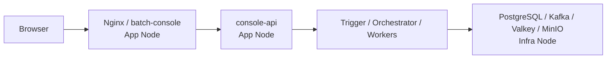
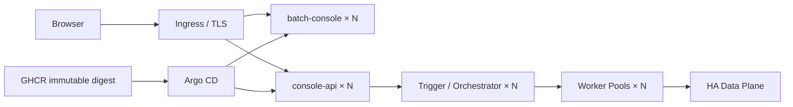

# 前端 CD 方案与统一发布待办

> 状态：规划 / 待实施
> 当前路线：Docker Compose + GitHub Actions + GHCR + SSH
> 后续路线：Kubernetes + Helm + GitOps

## 1. 定位

前端不单独维护另一套发布体系，而是加入 File Batch System 的统一 release set。平台级路线由配对后端 docs/runbook/compose-cd-roadmap.md 维护。

当前已有：

- docker-compose.deploy.yml：从 GHCR 拉部署镜像；
- /healthz：健康检查；
- /version.json：Git SHA 校验；
- staging-gate.yml：真实 staging Playwright、视觉回归、Lighthouse；
- release-promotion / rollback 文档：同一制品晋级与回滚原则。

缺口是把这些能力串成自动 CD，并与后端 digest 绑定为同一 release set。

## 2. 目标链路

    main
      -> build batch-console image
      -> push GHCR + capture digest
      -> 与后端 digests 组成 release manifest
      -> staging 自动 SSH + Compose
      -> /healthz + /version.json + RepoDigest
      -> Playwright + visual + Lighthouse
      -> production approval
      -> SSH + Compose 晋级同一 digest
      -> 失败恢复上一稳定 release set

production 不重新 build，不部署 latest。

## 3. 与后端的统一契约

一次 release 至少记录 frontend Git SHA + digest、后端 console-api / trigger / orchestrator / 五类 worker digest、staging 验收状态、production 状态和上一稳定 release set。

sha-<full> 标签继续用于可读性；环境事实以 digest 为准。

## 4. 前端待办

### P0

- [ ] build-image 输出 ghcr.io/pinpols/batch-console@sha256:...。
- [ ] 接入统一 release manifest。
- [ ] Linux SSH Compose 部署入口复用 docker-compose.deploy.yml。
- [ ] staging 自动部署后检查 /healthz。
- [ ] /version.json.gitSha 与 manifest 一致。
- [ ] 运行容器 RepoDigest 与 manifest 一致。
- [ ] 自动触发现有 Playwright / visual / Lighthouse。
- [ ] gate 失败恢复上一 frontend digest，并阻断整个平台 release set 晋级。
- [ ] production 使用 GitHub Environment 人工审批。
- [ ] production 只接受 staging 已通过 manifest。
- [ ] production 再次执行 health/version/digest 校验。

### P1

- [ ] Actions summary 记录 release ID / Git SHA / digest。
- [ ] deployment concurrency lock。
- [ ] 失败上传 Compose 状态、容器日志和版本信息。
- [ ] 保留最近 N 个 staging-verified release set。
- [ ] 验证前端回滚与后端版本兼容窗口。
- [ ] 演练 Nginx 启动失败、后端不可达、错误 digest、SSH 中断和 E2E 失败。
- [ ] 清理 Windows 原生部署入口；部署基线统一 Linux，Windows 开发机走 WSL2/Docker Desktop。

### P2

- [ ] 独立 deployment/ops repo 管理 frontend digest。
- [ ] Argo CD 先接 staging，再迁 production。
- [ ] GitOps 继续复用 /healthz、/version.json 和 staging E2E。
- [ ] GitOps 稳定前保留 Compose CD 回滚路径。

## 5. 与 release-promotion 的关系

现有 release-promotion 的“同一制品从 staging 晋级 production”原则保留。本方案把“同一前端制品”扩展为“同一前后端 release set”，并把 tag 校验提升为 digest 校验。

实施完成后，release-promotion 负责操作步骤，本文件负责 CD 架构和路线，避免两个权威来源重复。

## 6. 当前不做

- 不直接把 production 切到 Argo CD。
- 不维护与后端不同的审批/回滚语义。
- 不在部署机 npm ci / npm run build。
- 不用 latest 作为 staging → production 晋级凭据。
- 不把已有 Helm/Argo 规划描述成 GitOps 已落地。

## 7. 当前与最终生产架构中的前端位置

前端服务器规格、数据平面和平台最终拓扑以配对后端的 `docs/runbook/compose-cd-roadmap.md` 为唯一事实源，本仓不复制第二份硬件表。

当前 Compose 生产基线：

最终 Kubernetes / GitOps 目标：

前端在两个阶段保持相同发布契约：immutable image digest、`/healthz`、`/version.json`、staging E2E、与后端共同组成 release manifest。部署执行器从 SSH + Compose 切到 Argo CD 时，不改变这些契约。

## 8. 前端生产边界

- Nginx / batch-console 是 Web 入口，不承载数据库、Kafka 或对象存储职责。
- 浏览器只访问公开 Web/API；不得直接访问 PostgreSQL、Kafka、Valkey、MinIO。
- production 不在服务器执行 npm build；只运行 CI 已构建并通过 staging 的镜像 digest。
- 多副本阶段前端保持无状态；配置通过构建/运行时受控入口提供。
- 前端回滚必须与平台 release set 一起判断兼容性，不能只看前端单镜像是否可启动。
